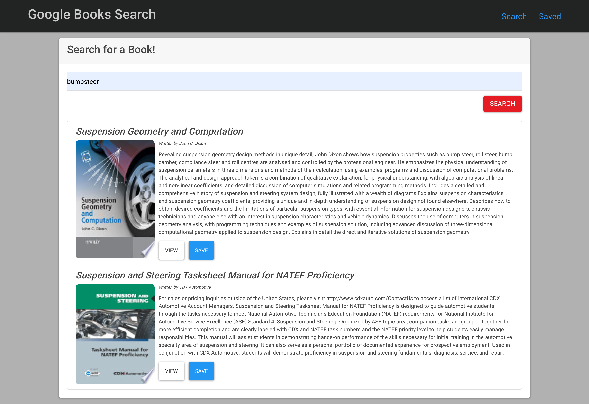

# Google Books Search
      
    

## Description

This book search application lets you keep track of your expenses online and offline. If you lose internet connection, no worries! This app will still record your expenses and when an internet connection is established, it will send all of the stored, offline data to the database to be permanently stored. By using a Mongodb database and Mongoose, the user is able to add any money they have gained or spent and keep track of their expenses by means of a clean, interactive chart. This app utilizes MongoDB, Mongoose, IndexedDb, Express, Express router, Node.js, and more.

## [Click Here to check it out!](https://young-woodland-55260.herokuapp.com/)

​
​

## Table of Contents

* [License](#license)
* [Questions](#questions)

## License

This project is licensed under the APACHE 2.0 license.

## Questions

If you have any further questions, you can reach me directly here: lovins.jacob@yahoo.com

You can find more of my work at [https://github.com/jacoblovins/](https://github.com/jacoblovins/).